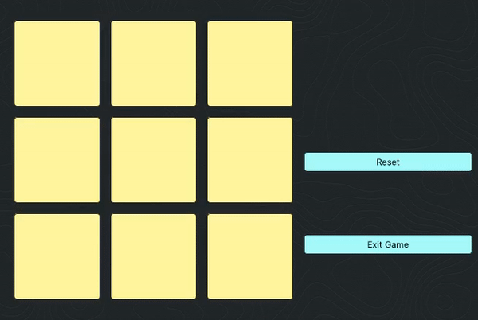

# dql-for-tic-tac-toe
I trained a deep Q-learning model to play tic tac toe

# Preview

## Network Architecture
+ Input layer of 27 neurons
+ Fully connected layer with 64 neurons and ReLU activation
+ Fully connected layer with 32 neurons and ReLU activation
+ Output layer of 9 neurons

## Train the model
**Note**: If you just want to play against the model, there's already a pretrained model that you can play against.

+ It is recommended to use a venv
+ Install the dependencies with `pip install -r requirements.txt`
+ Run the training script: `python train.py`
+ It saves the model to a checkpoint file every `SAVE_FREQUENCY` episodes, which is set
 by default to `500`.
+ If you directly run the `train.py` file, it will continue training from where it left
 off. You can either delete the `HAL9000.pt` file or change the `SAVE_FILE` path to
 train from scratch.

## Play against the model
Just run `python play.py` after installing the dependencies
